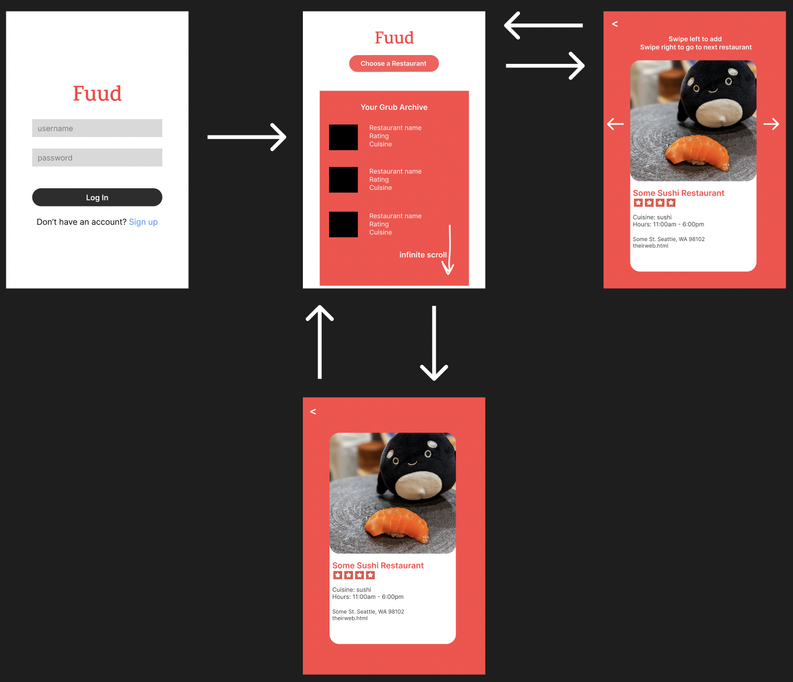

FÜÜD - README
===
 
## Table of Contents
1. [Overview](#Overview)
1. [Demo](#Demo)
1. [User Stories & Build Progress](#User-Stories-&-Build-Progress)
1. [Product Spec](#Product-Spec)
1. [Wireframes](#Wireframes)
2. [Schema](#Schema)
1. [What's Next?](#What's-Next?)

## Overview
### Description
FÜÜD is a food recommendation app that makes choosing restaurants easier by suggesting nearby restaurants one after another to an individual. Users can swipe left to reject or swipe right to save that restaurant into a favorites list.

### App Evaluation
- **Category:** Lifestyle 
- **Mobile:** Using the Yelp Fusion API, it will have the user's location and take in real time data about surrounding restaurants. It will have a details page for each restaurant for a user to access. And it will allow the user to save any restaurant into their own favorites section. For now, it'll only run from a iOS mobile device. 
- **Story:** The fascinating thing about FÜÜD is that it is a hybrid mobile app, bringing the best features of both Yelp and Tinder, allowing users to quickly scan, swipe and add suggested restaurants. This app is perfect for our friends and peers who have short attention spans and dislike scrolling through dozens of restaurants at once. 
- **Market:** Dining out and spending outdoor time will always be part of the world. FÜÜD provides quick, targeted suggestions for people who don't want to spend hours deciding on what to eat. 
- **Habit:** FÜÜD's swipe feature, in addition to the personalized list of liked restaurants, ensures that the app will not only satisfy user's needs, but also aim to let users enjoy being given one choice at a time. Users will consume FÜÜD to make quick choices for them and the opportunity to explore restaurants in an addicting fashion. It's FÜÜD's goal to provide a solution to hungry diner's indecision and to give them a worthwhile experience while using the app.
- **Scope:** The complete app that includes displaying restaurant suggestions, enabling the swipe feature, and including the restaurant into a personalized list might be a challenge to finish all by the end of the program. However, the stripped down version that includes displaying personalized individual restaurants to the user using geolocation will be the goal. If done, it will undoubtedly give us a broader view of what types of mobile apps we are capable of creating. 

## Demo

###  Our Final [Demo Video](https://www.youtube.com/watch?v=b10uyFbhYWk)

## User Stories & Build Progress
The following **required** functionality is completed:

### Sprint #3:
- [x] Layout and overall design streamlined, including update to logo as: FÜÜD
- [x] Implemented manual input for city after login including a "skip" option for existing users
- [x] Mapview added to details screen, focusing on annotated restaurant location and surrounding streets
- [x] Swipe-to-remove added to Favorites list screen

#### Sprint#3 Video Walkthrough

Here's a walkthrough of implemented user stories (build progress):

### Sprint 2:
- [x] Once user signs up or logs in, user will come to screen asking for location input which will render restaurant cards for the user to swipe through.
- [x] User will stay logged in as they navigate through app, user will be able to log out too. 
- [x] When user wants more information on restaurant, user can tap on restaurant card to navigate to restaurant details screen.
- [x] User can swipe left to reject restaurant or swipe right or press the 'like' button (characterized by a white spoon with a filled red heart) to then add the restaurant to their "Favorites" page.
- [x] When user clicks on 'Favorites List' user can see their individualized favorited restaurants with image and name visible. 

#### Sprint #2 Video Walkthrough

Here's a walkthrough of implemented user stories (build progress):

### Sprint 1:

- [x] When user opens app, there should be a launch screen with logo (vector img obtained from https://www.vecteezy.com/vector-art/13043198-abstract-two-tea-spoons-keep-on-the-table-logo-design-icon-tableware-element-kitchenware-vector-illustration)
- [x] When user opens app and after seeing launch screen, user will see login screen with: FUUD logo, username text field, password text field, signin button, sign up button
- [x] Screen shows one restaurant suggestion at a time. Suggestion includes: restaurant image, name, yelp stars, and cuisine type. User can swipe to get different restaurant suggestion.

#### Sprint #1 Video Walkthrough

Here's a walkthrough of implemented user stories (build progress):

## Product Spec

### 1. User Stories (Required and Optional)

**Required Must-have Stories**

* Accesses user location to get nearby restaurant information from Yelp API
* Suggests restaurants and displays to the user one-by-one, with name, image, yelp stars, relative cost, cuisine-type, and distance from location.
* User swipes left to dismiss a restaurant and right to like/favorite a restaurant.
* Detailed view for each restaurant, perhaps by swiping up or having a separate details page by tapping on picture.
* Authentication through logging in so user's can save their restuarants
* Settings

**Optional Nice-to-have Stories**

* Page of liked/favorited restaurants
* User picks preferences (cuisine-type, cost range, maximum distance, etc...)
* Log of previously visited restaurants
* Display directions from user location to restaurant (step-by-step and/or map)

### 2. Screen Archetypes

* Login Screen
   * User can log in with username/password
   * User can sign up for an account
   * Validation of form inputs for invalid data
* Home Screen
   * One click button to initiate restaurant discovery
   * If returning to the app, the view below it displays past restaurants that a user swiped right on
   * Restaurants can be removed and the whole list cleared 
   * Clicking a restaurant enters detailed view
* Restaurant Explorer
   * User location is obtained and a randomized restaurant is presented for users to swipe left or right
   * Button to return to the main screen once finished 
* Restaurant Detail View
   * Expands on restaurant details with images and contact information
   * View with map that can be clicked to redirect to user's preferred map app to get directions
* Settings 
   * Filters to further refine types of restaurants shown in Explorer
   
### 3. Navigation

**Tab Navigation** (Tab to Screen)

* Fill out login in and submit
* Fill out login info and sign up if no previous account

**Flow Navigation** (Screen to Screen)

* Main page displays button to navigate to search page
* Initial view is a restaurant card using custom XIB user interface with [Yelp Fusion API](https://fusion.yelp.com/) data
   * Navigation will be implemented using [KolodaView](https://github.com/Yalantis/Koloda) installed via [CocoaPods](https://cocoapods.org/)
      * Swipe left to add restaurant to Fuud archive
      * Swipe right to select another restaurant
* Main page displays list of archive in infinite scroll and navigates to details page
   * display details of restaurant 

## Wireframes

### Digital Wireframes & Mockups

## Schema 

### Models
#### User
| Property     | Type           | Description                 |
| ------------ | -------------- | -------------               |
| userId   | String     | unique id for user                  |
| createdAt     | DateTime       | date when user account is created  |
| numberOfLikes | Number | number of likes user has made |
| userUsername | String | username for user account |
| userPassword | String | password for user account |

#### User's Restaurant Archive
| Property     | Type           | Description         |
| ------------ | -------------- | -------------       |
| restaurant   | Pointer to Restaurant | each restaurant to add to archive  |
| restaurantArray | Array       | container to hold restaurant  |

#### Restaurant
| Property     | Type           | Description                 |
| ------------ | -------------- | -------------               |
| restaurantId | String         | unique id for restaurant    |
| image        | File           | image for restaurant        |
| restaurantName| String        | restaurant name|
| address      | String         | restaurant address |
| phoneNum     | Number         | restaurant phone number |
| cuisineType  | String         | restaurant cuisine type |
| rating       | Number(float)  | restaurant rating |
| price        | String         | restaurant relative cost |

### **Networking**

* Login Screen
    * (Create/POST) Create a new user object
    * (Read/GET) Query logged in user object
* Home Screen
    * (Read/GET) Fetch restaurant-archive object
    * (Create/POST) Create new restaurant object in restaurant-archive object
    * (Delete/DELETE) Restaurant removed from restaurant-archive object
* Restaurant Explorer
    * (Create/POST) Add restaurant to restaurant-archive object
* Restaurant Detail View
    * (Read/GET) Fetch restaurant info from restaurant-archive object

## What's Next?

There’s a lot more work to be done!
* Detailed restaurant view for each favorited restaurants
* Read restaurant reviews on the app itself
* Use GPS location to get live local restaurant suggestions
* Implement a “Feeling Lucky!” button to suggest a single restaurant option using machine learning, by aggregating data on the user’s past favorited restaurants
